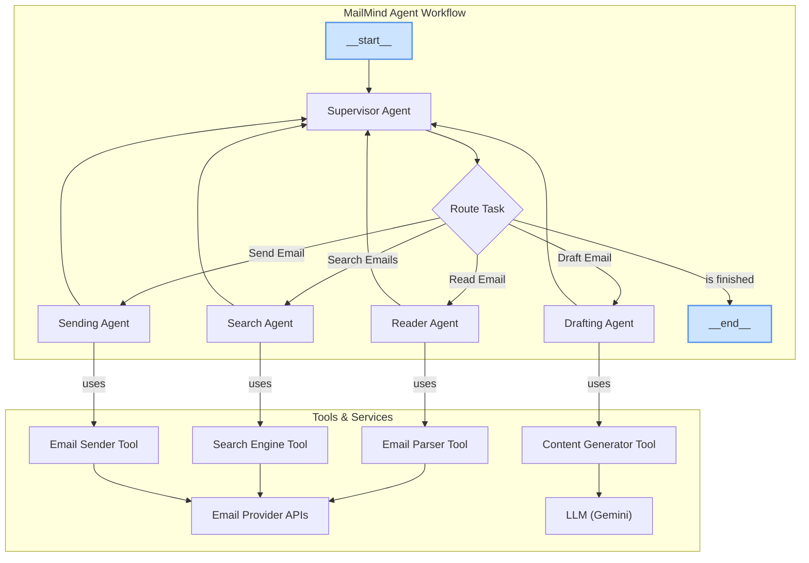
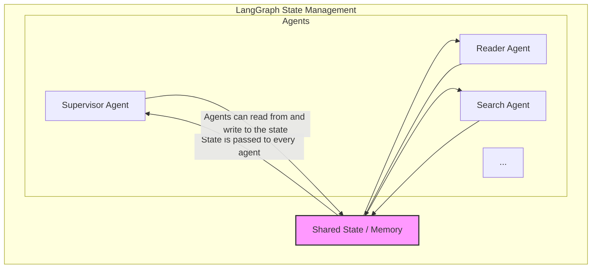

# MailMind - Intelligent Email Orchestration System

[](https://github.com/AbdelrahmanEbid/mailmind/actions/workflows/ci.yml)
[](https://github.com/AbdelrahmanEbid/mailmind/actions/workflows/integration-tests.yml)
[](https://langgraph-studio.vercel.app/)

## Overview

MailMind is an intelligent email orchestration system built with LangGraph that automates and enhances email management through AI-powered workflows, contextual understanding, and long-term memory.

## Features

- 🤖 **AI-Powered Email Processing**: Intelligent reading, parsing, and understanding of email content.
- 🔍 **Natural Language Search**: Find emails using conversational queries.
- ✍️ **Context-Aware Drafting**: Generate professional emails with proper context and tone.
- 📤 **Secure Email Sending**: Validated email delivery with comprehensive error handling.
- 🧠 **Long-term Memory**: Persistent context and relationship understanding.
- 🔄 **Multi-Agent Architecture**: Specialized agents for different email operations.
- 📊 **LangSmith Integration**: Comprehensive tracing and monitoring.

## Technology Stack

- **Framework**: LangGraph, LangChain
- **LLM**: Google Gemini
- **Memory**: LangGraph Store with persistent checkpointing
- **Testing**: pytest with LangSmith integration
- **Monitoring**: LangSmith tracing and evaluation

## Quick Start

This guide uses the `Makefile` for streamlined setup and development.

### Prerequisites

- Python >= 3.11
- Google Gemini API key
- Email provider API credentials (Gmail)
- `make` command-line utility

### Installation & Setup

```bash
# 1. Clone the repository
git clone https://github.com/AbdelrahmanEbid/mailmind.git
cd mailmind

# 2. Install development dependencies
# This command uses the Makefile to set up your environment, including langgraph-cli.
make install-dev

# 3. Create your environment configuration file
# This copies the example file to a new .env file.
make setup-env
```

### Configuration

Now, open the `.env` file and add your credentials:

```bash
# Required API Keys
GOOGLE_API_KEY=your_gemini_api_key
LANGSMITH_API_KEY=your_langsmith_api_key

# Email Provider Configuration
EMAIL_PROVIDER=gmail  # or outlook, custom
GMAIL_CLIENT_ID=your_gmail_client_id
GMAIL_CLIENT_SECRET=your_gmail_client_secret

# Optional Configuration
LANGCHAIN_PROJECT=mailmind
LOG_LEVEL=INFO
MAX_EMAIL_RESULTS=50
```

### Running the Development Server

```bash
# Start the development server using the Makefile shortcut
make dev
```

The server will be available at `http://127.0.0.1:8000`.

### Basic Usage (as a library)

You can also use MailMind as a Python library in your own applications.

```python
from mailmind import create_mailmind_graph
from mailmind.config import MailMindConfig

# Initialize the system
config = MailMindConfig()
graph = create_mailmind_graph(config)

# Search for emails
result = await graph.ainvoke({
    "messages": [("user", "Find emails from Sarah about the Q3 budget")]
})
print(result)

# Draft a response
result = await graph.ainvoke({
    "messages": [("user", "Draft a professional response to Sarah's budget email")]
})
print(result)
```

## Architecture

MailMind is built using a powerful multi-agent supervisor architecture, orchestrated with **LangGraph**. A central supervisor agent directs tasks to a team of specialized agents, each equipped with specific tools to handle different aspects of email management.

The entire system is monitored using **LangSmith** for observability and debugging.

### Agent Workflow

The primary control flow is managed by the supervisor. It analyzes the user's request, routes it to the appropriate specialized agent, and determines when the task is complete. After an agent finishes its job, it reports back to the supervisor, which decides the next step. This cyclical process continues until the user's request is fully resolved.



### Shared State (Memory)

In LangGraph, all agents (nodes) share a common "state" that acts as the system's memory. This state object holds the conversation history, agent outputs, and intermediate steps.

Instead of cluttering the workflow diagram with connections to a memory store, it is implicitly understood that every node can read from and write to this shared state. This makes the architecture cleaner and easier to follow.



## Project Structure

```
mailmind/
├── src/
│   └── mailmind/
│       ├── __init__.py
│       ├── graph.py              # Main graph definition
│       ├── agents/               # Specialized agents
│       │   ├── supervisor.py     # Supervisor agent
│       │   ├── reader.py         # Email reading agent
│       │   ├── search.py         # Search agent
│       │   ├── drafter.py        # Email drafting agent
│       │   └── sender.py         # Email sending agent
│       ├── tools/                # Tools for email operations
│       ├── state/                # State management
│       ├── config/               # Configuration management
│       └── utils/                # Utility functions
├── tests/
│   ├── unit_tests/
│   ├── integration_tests/
│   └── conftest.py
├── docs/
├── .github/
├── .env.example
├── langgraph.json
├── pyproject.toml
├── Makefile
└── README.md
```

## Development

The `Makefile` contains shortcuts for all common development tasks.

### Running Tests

```bash
# Run all tests
make test

# Run unit tests only
make test-unit

# Run integration tests only
make test-integration

# Run with coverage report
make test-coverage
```

### Code Quality

```bash
# Lint code
make lint

# Format code
make format

# Type check
make typecheck
```

### Other Commands

```bash
# Install development dependencies
make install-dev

# Start development server
make dev

# Build project documentation
make docs

# Clean build artifacts
make clean
```

## License

This project is licensed under the MIT License - see the `LICENSE` file for details.

## Support

- 📖 [Documentation](docs/)
- 🐛 [Report Issues](https://github.com/AbdelrahmanEbid/mailmind/issues)

## Acknowledgments

- Built with [LangGraph](https://github.com/langchain-ai/langgraph)
- Powered by [Google Gemini](https://ai.google.dev/)
- Monitored with [LangSmith](https://smith.langchain.com/)