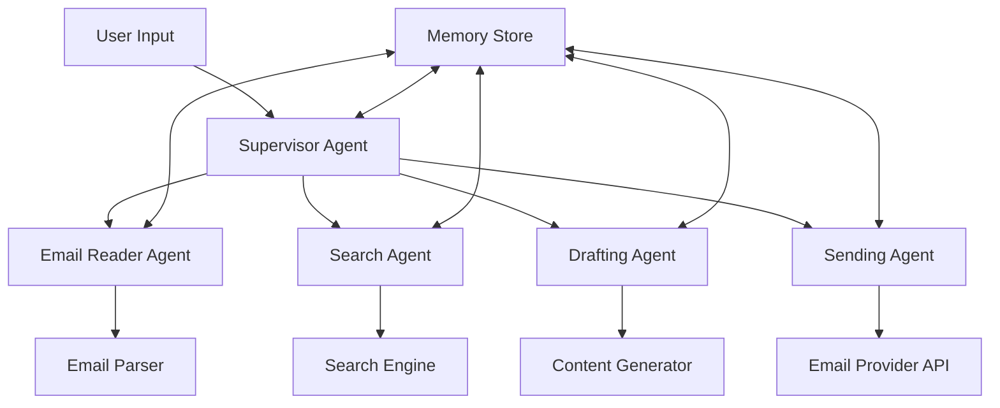

# MailMind - Intelligent Email Orchestration System

[](https://github.com/AbdelrahmanEbid/mailmind/actions/workflows/ci.yml)
[](https://github.com/AbdelrahmanEbid/mailmind/actions/workflows/integration-tests.yml)
[](https://langgraph-studio.vercel.app/)

## Overview

MailMind is an intelligent email orchestration system built with LangGraph that automates and enhances email management through AI-powered workflows, contextual understanding, and long-term memory.

## Features

- 🤖 **AI-Powered Email Processing**: Intelligent reading, parsing, and understanding of email content
- 🔍 **Natural Language Search**: Find emails using conversational queries
- ✍️ **Context-Aware Drafting**: Generate professional emails with proper context and tone
- 📤 **Secure Email Sending**: Validated email delivery with comprehensive error handling
- 🧠 **Long-term Memory**: Persistent context and relationship understanding
- 🔄 **Multi-Agent Architecture**: Specialized agents for different email operations
- 📊 **LangSmith Integration**: Comprehensive tracing and monitoring

## Technology Stack

- **Framework**: LangGraph, LangChain
- **LLM**: Google Gemini
- **Memory**: LangGraph Store with persistent checkpointing
- **Testing**: pytest with LangSmith integration
- **Monitoring**: LangSmith tracing and evaluation

## Quick Start

### Prerequisites

- Python >= 3.11
- Google Gemini API key
- Email provider API credentials (Gmail)

### Installation

```bash
# Clone the repository
git clone https://github.com/AbdelrahmanEbid/mailmind.git
cd mailmind

# Install dependencies
pip install -e .

# Or with development dependencies
pip install -e ".[dev]"
```

### Configuration

Create a `.env` file in the project root:

```bash
# Required API Keys
GOOGLE_API_KEY=your_gemini_api_key
LANGSMITH_API_KEY=your_langsmith_api_key

# Email Provider Configuration
EMAIL_PROVIDER=gmail  # or outlook, custom
GMAIL_CLIENT_ID=your_gmail_client_id
GMAIL_CLIENT_SECRET=your_gmail_client_secret

# Optional Configuration
LANGCHAIN_PROJECT=mailmind
LOG_LEVEL=INFO
MAX_EMAIL_RESULTS=50
```

### Running with LangGraph CLI

```bash
# Start the development server
langgraph dev

# Or with uv (recommended)
uvx --from "langgraph-cli[inmem]" --with-editable . langgraph dev
```

### Basic Usage

```python
from mailmind import create_mailmind_graph
from mailmind.config import MailMindConfig

# Initialize the system
config = MailMindConfig()
graph = create_mailmind_graph(config)

# Search for emails
result = await graph.ainvoke({
    "messages": [("user", "Find emails from Sarah about the Q3 budget")]
})

# Draft a response
result = await graph.ainvoke({
    "messages": [("user", "Draft a professional response to Sarah's budget email")]
})
```

## Architecture

MailMind uses a multi-agent supervisor architecture with specialized agents:



## Project Structure

```
mailmind/
├── src/
│   └── mailmind/
│       ├── __init__.py
│       ├── graph.py              # Main graph definition
│       ├── agents/               # Specialized agents
│       │   ├── __init__.py
│       │   ├── supervisor.py     # Supervisor agent
│       │   ├── reader.py         # Email reading agent
│       │   ├── search.py         # Search agent
│       │   ├── drafter.py        # Email drafting agent
│       │   └── sender.py         # Email sending agent
│       ├── tools/                # Tools for email operations
│       │   ├── __init__.py
│       │   ├── email_reader.py
│       │   ├── email_search.py
│       │   ├── email_composer.py
│       │   └── email_sender.py
│       ├── state/                # State management
│       │   ├── __init__.py
│       │   ├── email_state.py
│       │   └── memory_state.py
│       ├── config/               # Configuration management
│       │   ├── __init__.py
│       │   └── settings.py
│       └── utils/                # Utility functions
│           ├── __init__.py
│           ├── email_parser.py
│           └── validators.py
├── tests/
│   ├── unit_tests/
│   │   ├── __init__.py
│   │   ├── test_agents.py
│   │   ├── test_tools.py
│   │   └── test_config.py
│   ├── integration_tests/
│   │   ├── __init__.py
│   │   └── test_graph.py
│   └── conftest.py
├── docs/
│   ├── FRS.md                    # Functional Requirements Specification
│   ├── CODING_PATTERNS.md        # Coding patterns and best practices
│   └── API.md                    # API documentation
├── static/                       # Static assets
├── .github/
│   └── workflows/
│       ├── ci.yml
│       └── integration-tests.yml
├── .env.example
├── .gitignore
├── langgraph.json               # LangGraph configuration
├── pyproject.toml               # Project dependencies and configuration
├── Makefile                     # Development commands
└── README.md
```

## Development

### Running Tests

```bash
# Run all tests
make test

# Run unit tests only
make test-unit

# Run integration tests only
make test-integration

# Run with coverage
make test-coverage
```

### Code Quality

```bash
# Lint code
make lint

# Format code
make format

# Type check
make typecheck
```

### Development Commands

```bash
# Install development dependencies
make install-dev

# Start development server
make dev

# Build documentation
make docs

# Clean build artifacts
make clean
```

## License

This project is licensed under the MIT License - see the [LICENSE](LICENSE) file for details.

## Support

- 📖 [Documentation](docs/)
- 🐛 [Report Issues](https://github.com/AbdelrahmanEbid/mailmind/issues)

## Acknowledgments

- Built with [LangGraph](https://github.com/langchain-ai/langgraph)
- Powered by [Google Gemini](https://ai.google.dev/)
- Monitored with [LangSmith](https://smith.langchain.com/)
